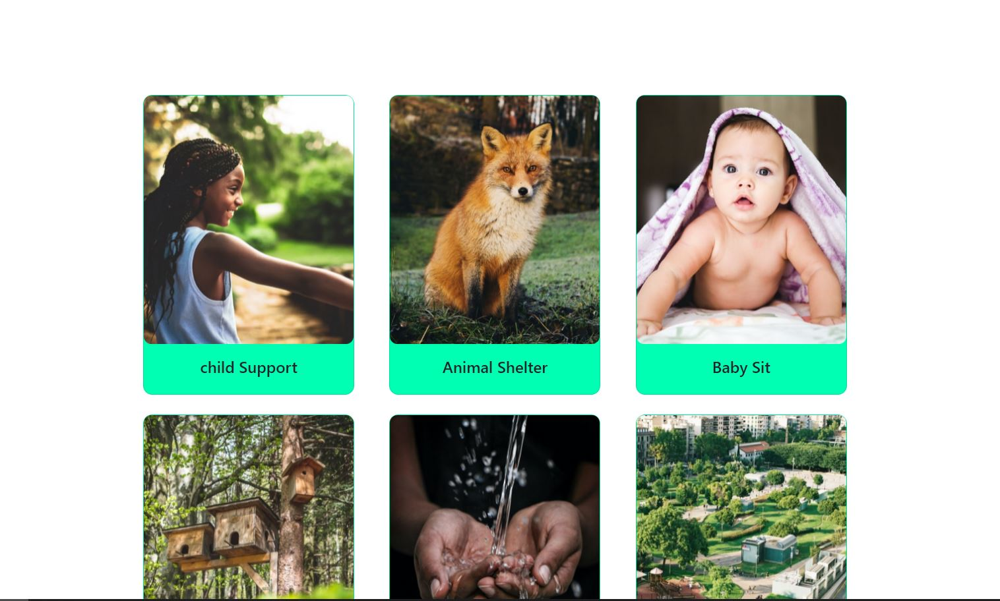

# Volunteer Network

### visit website [https://volunteer-networks.netlify.app/](https://volunteer-networks.netlify.app/)

+ Used imgbb for hosting image [https://imgbb.com/](https://imgbb.com/)

### Used Technology Front-End

+ HTML
+ CSS
+ JavaScript
+ React.js

### Back-End Technology

+ Node.js
+ Express.js
+ MongoDb (database)

### [view back-end code](https://github.com/rjmahfuztech/volunteer-network-server)
